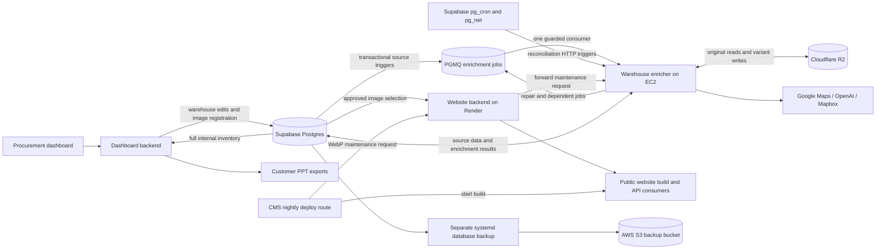

# Warehouse enricher: service and enterprise context

This document describes the operating model as of 1 October 2026. Start here
for the service's purpose and relationships; use the linked runbooks for commands.
The project is **warehouse-enricher**, in the
[procurement-enrichment repository](https://github.com/rs0125/procurement-enrichment).
It grew from the warehouse geocoder, which explains the retained production unit
and hostname. There is one application, not a second geocoder to deploy.

## Role in WareOnGo

WareOnGo's procurement workflow creates and maintains warehouse inventory.
Internal teams use that inventory in the dashboard, shortlists and customer PPTs;
the public website presents a curated subset. The enricher turns existing source
data into reusable results: coordinates, nearby landmarks, image descriptions,
website suitability assessments, and compressed image variants.

The service reads and writes the shared Supabase database and stores variants in
Cloudflare R2. Enrichment is asynchronous relative to a warehouse edit. Creating
a warehouse or generating a PPT does not wait for this worker's model calls.

| System | Responsibility and relationship |
|---|---|
| [Dashboard frontend](https://github.com/WareOnGo/WAG_Dashboard) and [backend](https://github.com/WareOnGo/Dashboard_Backend) | Own authenticated warehouse workflows, staged approvals, media edits and PPT generation. The backend registers source image URLs after writes and reads enrichment results. |
| This service | Executes bounded enrichment actions, scheduled reconciliation and processing. Owns publication of its derived fields, retry state and run records. |
| [Website backend](https://github.com/rs0125/WareOnGo-Website-Backend) | Owns public gallery selection and its privacy/quality fallbacks. Reads the shared registry; forwards WebP maintenance to EC2. |
| [Website frontend](https://github.com/WareOnGo/wareongo-website) | Consumes approved galleries for pages, covers, image sitemaps, structured data and social images. Static content changes when the site is rebuilt. |
| [CMS](https://github.com/rs0125/wog-cms) | Starts the website build and WebP maintenance request independently, in parallel. It does not wait for compression to finish. |
| [CRM automations](https://github.com/rs0125/twenty-automations) | Separate application and deployment for CRM/messaging workflows. Sharing enterprise data does not make it part of this worker. |
| Supabase, R2 and S3 | Postgres stores domain data and processing state; R2 stores source images and variants; S3 stores database backups. Database backups are not backups of R2 image bytes. |

The worker does not own warehouse CRUD, customer communications, website
deployment, OSM ingestion, or R2 orphan deletion. Its co-located backup is a
separate systemd job, outside the enrichment action executor.

## Data ownership and image identity

| Data | Source of truth / permitted responsibility |
|---|---|
| `Warehouse.media` | Canonical image membership and order, maintained by warehouse writers. Retained unchanged by enrichment. |
| Legacy `Warehouse.photos` | Membership fallback only when `media.images` is absent. An explicit empty `media.images` array remains authoritative. |
| `labeled_warehouse_images` | Shared image registry, one row per original `imageUrl`. Stores labels, captions, variants, assessments and processing state, not image bytes. |
| `Warehouse.photosWebp` | Compatibility projection of the registry in source order. Missing variants retain null slots; this is not a replacement for `media`. |
| `WarehouseData.latitude` / `longitude` | Coordinates filled by geocoding when missing. Concurrent source URL and coordinate edits are preserved. |
| `GeocodeAttempt` | Per-warehouse geocoding attempts, success and retry eligibility. |
| `warehouse_proximity` | Derived landmark answers, distances, provider, source coordinates and provenance per warehouse/category. |
| OSM/POI tables and coverage records | Inputs maintained by the separate ingestion workflow. The enricher requires sufficient coverage before computing results. |
| `CronRunLog` | Shared operational history, scheduled-run locks and guarded JPEG/geocode/proximity attempt metadata, distinguished by `jobName`. |
| Private `pgmq` / `enrichment` schemas | Durable ID-only jobs, receipts, archives, dead letters, paged refresh and guarded queue operations. Not exposed to browser roles. |

A registry row's `imageId` is different from a `warehouseId`. One original URL
can appear in multiple warehouses. Current associations come from warehouse
media references; the image row's historical `warehouseId` is not an exhaustive
ownership list. A removed image can remain referenced by another warehouse.

The registry groups these results on the same row:

- **Original:** `imageUrl`, storage bucket/object metadata where known. Original
  URLs and bytes remain available; compressed uploads never replace them.
- **Scene:** `classification`, `description` (the caption), confidence and model
  provenance. Document subtype has its own `documentKind` action/state.
- **WebP:** explicit `webpUrl`, object key, byte count, version and timestamps.
- **JPEG:** explicit `jpegUrl`, byte count, version, timestamp, status and error.
  For a suitable small JPEG, `jpegUrl` can equal `imageUrl` without another upload.
- **Website:** decision, quality tier, assessment evidence, source hash and
  provenance, with a separate trusted override field.
- **Processing:** stage status, attempts, retry time and claims for scene,
  document, website and WebP processing; `unreferencedAt` records retention state.

Reconciliation inserts missing image rows and marks currently unreferenced
ones. It does not delete rows or storage objects. An `unreferencedAt` value alone
is not proof that an R2 object is an enterprise-wide orphan.

Source objects must be immutable: replacing a photo means using a new URL and
obtaining a new assessment. The website binds assessment/override metadata to
the recorded source hash; it does not re-download every original on requests.

The Prisma schema includes other applications' tables because the database is
shared. Schema visibility is not ownership. Do not run `prisma db push` against
Supabase; coordinate explicit, scoped schema changes with the owning services.

## Actions and dependencies

Every action accepts one explicit image or warehouse ID. HTTP, CLI and scheduled
batches invoke the same [service registry](../src/services/enrichment/index.mjs).

| Action | Input and result | Provider / policy |
|---|---|---|
| `geocode` | Warehouse Maps URL → missing coordinates and attempt record | Google Maps URL/CID extraction; not Mapbox geocoding |
| `proximity` | Warehouse coordinates → missing or coordinate-stale landmark categories | PostGIS/OSM shortlist, then Mapbox road routes; coverage and retry rules apply |
| `image-label` | Original → scene class, caption, confidence | `gpt-5.6-terra` by default through `IMAGE_LABEL_MODEL` |
| `document-kind` | Already-labelled document → subtype | Separate Terra action, using the same model setting |
| `website-approval` | Original → privacy decision, quality tier and evidence | `gpt-5.6-luna`, independently of scene labelling; completed historical Sol reviews are retained |
| `webp` | Original → website variant | Longest edge 1280 px, quality 75; can reuse an existing valid variant |
| `jpeg` | Labelled original → PPT-compatible variant | Photos 1280 px, documents 1920 px; quality 82, progressive, 4:2:0. Valid originals within dimensions and at most 200 KiB can be reused. |

Proximity needs coordinates; document subtype and JPEG sizing need the scene
label. WebP compression and website assessment do not need to wait for document
subtyping. Website *selection* nevertheless requires a usable scene label as
well as approval. A successful compression does not grant website permission.

Proximity covers highways, airports, rail stations, ports, city centres, bus
stations, hospitals, fire stations, police and fuel stations. Highway selection
is identity-only in this action; it preserves existing measured highway distances
from the separate routing workflow. A POI import watermark records provenance;
an import alone does not authorize a paid recomputation of every warehouse.

## End-to-end flows

### New warehouse or media edit

1. The dashboard commits the warehouse change or atomic staged approval. Database
   triggers enqueue a warehouse refresh in that same transaction. Imports and
   direct SQL writes share this boundary; rolled-back writes create no work.
2. The retained dashboard image hook registers URLs as a best-effort shortcut.
   The durable refresh also registers missing rows and plans work in pages of ten
   images, without resetting completed labels, variants or privacy decisions.
3. One EC2 queue consumer runs independent label/caption, website-assessment and
   WebP jobs. Document subtype waits for a scene label; proximity waits for valid
   coordinates. Existing geocoding scope, attempts and cooldowns still apply.
4. Crons remain scheduled to reconcile missed work, repair WebP projections and
   perform inventory checks. They enqueue due actions instead of running a second
   set of providers. JPEG is explicit, not automatically generated for every image.
5. Website/PPT readers consume stored fields using the existing fallback policies.

Both backends use the registry automatically, without image-pipeline read/write
flags. The queue worker is enabled by host configuration; repository defaults
remain cron mode for safe startup on other environments.

### Public website

The worker assesses an individual original. The website backend chooses the
gallery across all current warehouse images:

- Only approved, usable indoor/outdoor property photos are eligible. Visible
  letting boards or contact details are grounds to withhold a photo; uncertain
  cases are `REVIEW`. This hides whole images; it does not blur or redact pixels.
- Prefer T1/T2 photos, at most **eight**, aiming for an indoor/outdoor balance.
  Approved T3 photos can fill a **soft minimum of four**. Sparse galleries may
  contain fewer than four or zero.
- `BLOCK`, `REVIEW`, missing/pending/failed assessments, documents, unknown scenes
  and `UNUSABLE` photos never fill the minimum. Matching hashes deduplicate
  sources, and useful overview views receive cover preference.
- A selected original is the fallback when its WebP is unavailable. Rejected
  originals are never a fallback. Approval-read errors produce empty galleries.
- Trusted manual overrides require matching source identity and complete review
  metadata. This service does not provide a review UI. Model confidence is a
  diagnostic, not a guarantee of assessment accuracy.

Public list/detail responses and website builds consume this policy. Processing
does not itself rebuild the website or purge already-generated pages. Optional
image-cache invalidation updates backend caches; static output follows the build
cadence. Independently authored featured assets without registry associations
still need separate editorial review.

### Internal dashboard and PPTs

Internal readers retain the full media collection; website exclusion is not
global removal. The optional compressed PPT path uses stored **JPEG** variants,
with original-image fallback when the variant or lookup is unavailable. The
current last-mile template has a separate export path. Existing placeholder/skip
behaviour applies if both usable variant and original are unavailable.

Exports do not call this worker to compress or label images during the request.
WebP remains the website format; compressed PPTs use JPEG for compatibility.
The registry therefore keeps both explicit variants as well as the original.

## Triggers and execution model

| Trigger | Work and limits | Schedule |
|---|---|---|
| Supabase `sweep-warehouse-image-labels` → `POST /cron/enrichment` | Reconcile; up to 50 labels, 50 document kinds, 12 website assessments, 5 proximity warehouses; 10-minute overall budget | Every 15 minutes |
| CMS → website backend → EC2 `/maintenance/webp` | Same job as `/cron/webp`: complete R2 inventory check, due compression, legacy projection repair; at most 500 images / 45 minutes | Nightly website build trigger, 20:30 UTC / 02:00 IST |
| Supabase → `POST /cron/geocode-recent` | Up to 100 recent eligible warehouses / 10 minutes, paced by two seconds | 21:27 UTC / 02:57 IST |
| `warehouse-geocoder-backup.timer` | Separate consistent domain/PGMQ snapshot → S3, using its existing backup configuration | 22:30 UTC / 04:00 IST |

The geocoder selects warehouses created or status-updated within seven days,
with a Maps URL and missing coordinates. Successful attempts are excluded;
failed attempts are bounded at five and spaced at least 24 hours apart. Older
inventory has explicit backfill tooling, outside the nightly scope.

The reconciliation sweep visits **label → document → website → proximity**
under stage budgets. In production queue mode it enqueues due work; provider
execution belongs to the single consumer. Direct action POSTs return HTTP 202
with `QUEUED` and a message ID. One action executes at a time, reserving memory
before claiming; there is no prefetched payload backlog. Independent actions can
be delivered in any order, with prerequisites and follow-ups persisted in the DB.
HTTP, reconciliation and the separate backup can run concurrently. In cron/shadow
rollback modes the same bounded inline actions remain available.

Scheduled POSTs return `202` once the run is recorded, not when processing has
completed. GET on the same cron route returns progress; POST with
`{"dryRun":true}` previews configuration/backlog without changing state. Durable
run locks suppress duplicate sweeps and expire after the work budget plus five
minutes. The website backend forwards maintenance requests and does not start
a second local compressor when EC2 is unavailable.

## Completion, retries and fallbacks

Scene, document, website and WebP stages use five-minute database claims, unique
tokens, bounded attempts and retry times. Publication checks claim ownership,
lease and source identity; stale results cannot overwrite a newer owner. Ready
stages are skipped. A website `BLOCK` or `REVIEW` is a completed assessment, not a
processing failure to keep retrying until it becomes allowed.

JPEG, geocoding and proximity use guarded attempt metadata in `CronRunLog` under
queue delivery. Every queued publication checks current source and receipt
ownership in addition to its domain-stage guards. Each action changes its designated fields;
it does not rewrite the whole warehouse or image record.

Interrupted work is recoverable, but provider billing is not exactly-once: a
crash after a paid response and before publication can require another call.
Started model calls that time out consume an attempt. Exhausted, unsupported
and repeatedly deferred work needs operational attention; a cron existing does
not imply every row will eventually become ready without intervention.

WebP repair requires a complete storage listing before deciding that a recorded
variant is missing. It also repairs the legacy projection when there is no new
compression backlog. Originals remain intact throughout. Storage inventory is
still assembled in memory and should be revisited if the collection grows
substantially; the current worker is intentionally bounded for a small host.

## Code structure and configuration

| Location | Responsibility |
|---|---|
| `src/app.mjs`, `src/index.mjs` | Express composition, startup and graceful shutdown |
| `src/routes/`, `src/controllers/` | Authenticated HTTP contracts and thin handlers |
| `src/services/enrichment/` | Seven single-item actions and shared registry |
| `src/services/cron/` | Scheduled jobs, batch selection and stage budgets |
| `src/models/` | Database reads, claims, guarded writes and run logs |
| `src/lib/images/`, `googleMaps/`, `proximity/` | Provider adapters, source validation, encoding and domain policies |
| `src/lib/runtime/` | Memory admission and execution coordination |
| `scripts/enrich.mjs` | Explicit action CLI, including read-only previews |
| `tests/` | Unit, HTTP, native encoder, isolated database and deployment checks |
| `deploy/` | Release helper, AWS policies, systemd definitions and separate backup |

Image and proximity policies were ported from the dashboard. They are local
modules with no runtime imports from sibling repositories. Similar modules and
maintenance tools remain in the backends; changes to prompts, formats, gallery
contracts and versions must be coordinated across the writer and its readers.

See [`.env.example`](../.env.example) for names, never live credentials.
`DATABASE_URL` and `CRON_SECRET` are required for the application. OpenAI is
needed by image classification/approval, Mapbox by proximity, and R2 settings by
variant storage. `IMAGE_PIPELINE_CACHE_URL` is optional. Missing provider
configuration is reported for the relevant action rather than requiring all
providers for basic geocoding and health checks.

`/health` is public. `/enrichment`, `/cron/*` and `/queue/status` use `CRON_SECRET` bearer auth.
The compatibility `/maintenance/webp` route uses the existing purpose-specific
HMAC bearer derived from the shared R2 secret; the underlying R2 secret is never
sent as that bearer. Do not print environment files or raw scheduled SQL, which
can contain credentials.

## Runtime, deployment and operations

The service runs on an ARM `t4g.small` EC2 instance (2 GiB) in `ap-south-1`.
Caddy exposes `https://wareongo-cronjobs.duckdns.org` and proxies Node on port
3000. The retained unit name is `warehouse-geocoder.service`. Releases live
under `/opt/warehouse-enricher/`, and the old installation remains available for
backup compatibility and rollback. Runtime and build have separate non-login,
unprivileged accounts. The application cannot modify releases or configuration.

Memory control has several layers: one active action; admission checks on host
and cgroup availability; a 256 MiB Node heap; a 640 MiB systemd soft limit and
768 MiB hard limit. Native compression runs in a bounded child (64 MiB JS heap,
256 MiB RSS guard, 16-megapixel input cap, 30-second deadline), with downloads
capped at 20 MiB and disk-backed buffers. Website assessment also downloads
bounded image bytes for hashing/inspection; not every image path is disk-only.
These limits constrain the workload, not a promise that OOM can never occur.

Production buffers use `/var/lib/warehouse-enricher/buffers`; at least 256 MiB
of free disk is required. Each direct action has a 180-second budget. Database
connection count, query duration and transaction lifetime are bounded as well.
See [service limits and local verification](ENRICHMENT_SERVICES.md).

Pushes to `main` run [CI](CI.md). Successful CI triggers [EC2 CD](CD.md): GitHub
OIDC → restricted SSM command → root-owned release helper → isolated ARM build
and tests → health-only canary → atomic release switch and verification, with
rollback on failed promotion. Application releases cannot replace the installed
privileged helper. Deployment is deferred during **21:15–22:45 UTC** to protect
the nightly geocoder/backup window. No production schema push is part of CD.

Operational checks should follow the full chain:

1. `/health`, systemd status, memory/OOM events and restarts: is the process usable?
2. `cron.job_run_details` and `net._http_response`: did the scheduled request
   fire and get accepted? HTTP 202 alone is not job success.
3. `CronRunLog` parent runs (`geocode-recent`, `sweep_warehouse_enrichment`,
   `sweep_warehouse_webp`) and `enrichment:<action>` rows: did useful work finish?
4. Stage backlog, exhausted attempts, missing configuration, coverage and
   representative output: are new records progressing correctly?
5. Website selection/static rebuild and PPT fallback behaviour: do consumers
   actually see the intended result?
6. The separate backup timer, `backup-db` records and S3 objects: did backup run?

`GET` cron status and dry runs avoid paid calls and uploads. Use isolated local
PostGIS for fixture/fault tests; never point them at production. Backup/restore
scope, including the excluded Supabase `auth` schema, is in the
[backup runbook](../deploy/DB_BACKUP.md).

## Queue deployment and observation

PGMQ 1.5.1, private wrappers/grants and source triggers are installed. Normal
queue consumption began at 20:23 UTC on 1 October. The existing EC2 host runs
one consumer; no broker host or new credentials were added. Crons remain as
reconciliation, and their inline implementation is retained for rollback.

The [production record](PRODUCTION_2026-10-01.md#queue-activation) contains the
capture/rollback, live backup, bounded execution and memory checks. Two complete
nightly cycles under queue ownership remain to be observed before reducing any
recovery path. The initial activation does not certify sustained throughput or
exactly-once provider billing.

See [queue architecture](QUEUE_ARCHITECTURE.md), [delivery contract](QUEUE_CONTRACT.md),
[setup](QUEUE_SETUP.md), [backup/recovery](QUEUE_BACKUP.md) and
[rollout/rollback](QUEUE_ROLLOUT.md). Keep host configuration and source capture
separate: disabling triggers alone does not stop an active consumer.

## Further reference

- [README and local setup](../README.md)
- [Actions, CLI and tests](ENRICHMENT_SERVICES.md)
- [Proposed queue architecture](QUEUE_ARCHITECTURE.md), [work contract](QUEUE_CONTRACT.md), [rollout](QUEUE_ROLLOUT.md)
- [PGMQ evaluation and test findings](PGMQ_EVALUATION.md)
- [Scheduled work and stability gate](CRON_MIGRATION.md)
- [HTTP contracts](HTTP_API.md)
- [CI](CI.md), [release deployment and rollback](CD.md)
- [AWS host operations](../deploy/AWS_DEPLOYMENT.md), [database backup](../deploy/DB_BACKUP.md)
- [Website image reader contract](https://github.com/rs0125/WareOnGo-Website-Backend/blob/main/docs/image-pipeline.md)

The original [geocoder specification](geocode-cron-spec.md) is design history;
use the current API, architecture and deployment documents for operating behaviour.
