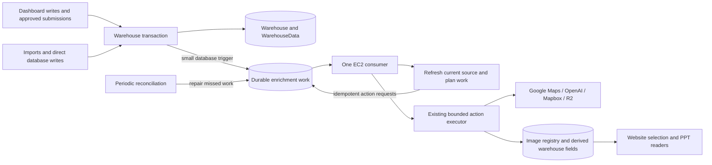
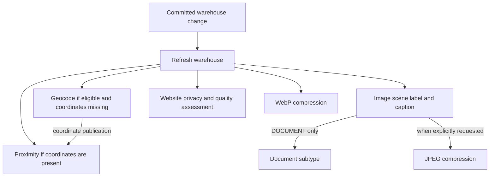

# Durable enrichment queue: architecture

Design recorded 29 September 2026; initial production activation completed
1 October, 20:23 UTC. The [current architecture](ARCHITECTURE.md),
[setup runbook](QUEUE_SETUP.md) and [production record](PRODUCTION_2026-10-01.md#queue-activation)
describe the deployed state and the remaining nightly observation. The design
details below explain the decisions; historical rollout gates are not evidence
that every observation period has elapsed.

Read this document for the decision and system boundaries, the
[work contract](QUEUE_CONTRACT.md) for delivery and concurrency semantics, and the
[rollout plan](QUEUE_ROLLOUT.md) for implementation order and acceptance checks.

## Recommendation

The [local PGMQ evaluation](PGMQ_EVALUATION.md) replaces the earlier custom-table
preference. PGMQ now owns production delivery; crons remain for reconciliation.

Use **Supabase Queues / PGMQ in the existing Supabase database**, consumed
by the existing enricher EC2 service. Start with one active enrichment action,
the existing memory limits, and a small polling loop. A warehouse write records
an inexpensive refresh request in the same transaction; EC2 discovers the affected
images and runs the existing seven action services.

The same-transaction `pgmq.send` also serves as the transactional outbox. There
is no separate outbox relay, Redis server, second EC2, or general workflow engine
in the first version. Messages carry IDs and bounded scheduling metadata;
originals, labels, captions, variants and website decisions continue to live in
their existing places.

There are two separate guarantees: a committed source change has durable delivery
intent, and a derived result is published only while its claim and source remain
valid. Neither guarantee makes external provider billing exactly-once.

## Why this shape fits the current service

| Option | Decision for the first version |
|---|---|
| In-process memory queue | Insufficient for delivery across crashes, releases and host restarts. Memory holds at most the active work item. |
| Redis/BullMQ | Adds a broker, persistence and another service to operate. Revisit only if its scheduling features justify that additional component. |
| SQS | Viable if workers later span hosts, but introduces a database-to-broker handoff and an outbox relay. Not needed for the initial single-host design. |
| Supabase Queues / PGMQ | Recommended after the local spike: transactional enqueue, visibility, concurrent delivery and crash recovery worked. Add guarded acknowledgement, domain policies and a version-aware backup path. |
| Small Postgres work table | Fallback if the extension/backup gates cannot be met. Avoid owning another lease/recovery engine without a demonstrated need. |

Supabase Queues is based on PGMQ and offers persistence and a delivery visibility
window; that is useful infrastructure, not an end-to-end promise about model calls
or R2 publication. [Supabase Queues documentation](https://supabase.com/docs/guides/queues).
Our project has PGMQ 1.5.1 installed. Use only verified APIs from
that version; the newer upstream release is not automatically available to us.
The local evaluation found stale acknowledgement and logical-backup pitfalls;
those are explicit rollout gates, not reasons to skip the application guards.

The deployment avoids an additional broker host, but database polling, indexes,
WAL and provider work still consume resources. Measure those costs during shadow
operation rather than attaching an unsupported monthly savings estimate.

## Preserve the application contracts

- `Warehouse.media` remains canonical membership/order. Legacy `photos` is a
  fallback only when `media.images` is absent; an explicit empty array stays empty.
- Original image URLs and raw R2 objects are retained. WebP and JPEG fields remain
  explicit. A reusable small JPEG can keep the original URL in `jpegUrl`.
- An image is identified by its registry `imageId`, and may belong to multiple
  warehouses. The historical image row `warehouseId` is not the membership index.
- Scene marking and website approval remain separate actions. BLOCK and REVIEW
  are completed assessments. Delivery must not retry them into ALLOW or replace
  existing manual/Sol-reviewed results.
- Public galleries retain their existing approval, tier, indoor/outdoor balance,
  soft minimum of four and maximum of eight. No queue fallback reveals an
  unassessed or blocked original. An approved original can replace a missing WebP.
- PPTs keep JPEG-to-original fallback. Warehouse writes, website reads and PPT
  generation do not wait for providers. Static website output still needs a build.

## Durable producer boundary

Recommend narrow database triggers on the source tables, rather than relying on
an HTTP request to the worker after the write. This covers imports and alternate
writers as well as the dashboard. The existing image registration hook is
post-commit and deliberately best-effort; it cannot be the only durable producer.

| Source change | Durable request |
|---|---|
| Warehouse creation; changes to `media`, legacy `photos`, `googleLocation`, or visibility | `refresh-warehouse` ID message for that warehouse |
| Warehouse deletion | Refresh/tombstone handling for that ID; cancel warehouse work and let image membership checks consider other owners |
| `WarehouseData` insert/delete or actual latitude/longitude change | Refresh that warehouse; valid coordinates can make proximity eligible |
| Scene completion | Ensure document subtype work if appropriate; wake an explicitly requested JPEG job |
| Explicit operator JPEG/backfill request | Ensure the requested action through the same durable interface |

The first two source triggers compare relevant values with `IS DISTINCT FROM`.
Writes of captions, assessments, `photosWebp`, job state, or other derived results
must not recursively generate refreshes. Trigger bodies do one small transactional `pgmq.send`;
they do not scan all media, contact a provider or invoke EC2.

Postgres executes a trigger in the source transaction, so failure rolls back both
the source write and its trigger effects. [PostgreSQL trigger semantics](https://www.postgresql.org/docs/current/trigger-definition.html).
This is an explicit availability tradeoff: a stopped EC2 does not prevent saves,
but a broken outbox insertion must fail the save, rather than acknowledge a write
whose durable event is missing. Test that API error behavior before enabling it.

Staged promotion commits the warehouse, details and approval link in one
transaction in dashboard revision `acec800`. The source event shares that
transaction, so a failed promotion leaves no provisional work. Drafts/rejections
must not cause provider work; a delay before processing is not an atomicity gate.

The website backend's current relevant path is reading galleries and forwarding
maintenance requests; it does not need a second queue SDK. Any future/direct
warehouse writes are covered at the same database boundary. The dashboard's
existing registration hook can remain during rollout, then be removed only after
the durable refresh path has proved it replaces that work.

## Work graph: dependencies without global barriers

Independent branches can be ready together; the first consumer executes them
one at a time. A failed image label does not hold up an unrelated geocode, WebP,
or website assessment. Subtype waits for a DOCUMENT scene; JPEG waits for a
completed scene to select 1280 px photo or 1920 px document sizing.

Queue migration initially preserves the current automatic action set. JPEG stays
operator-requested; automatic JPEG forward-fill for new media is a separate,
bounded follow-up decision after measuring its extra work. WebP and eligible
geocoding become eligible promptly after source changes instead of waiting for
their nightly processing sweep. Existing geocoder eligibility/attempt rules
still apply; a source edit does not authorize fleet-wide backfills.

Use action-specific readiness functions, not a generic DAG library. The worker
must move eligibility/cooldown rules now located in cron wrappers into shared
policy used by both delivery modes. In particular, calling the current geocode
or proximity single-item handler directly would bypass part of its scheduled
retry policy. JPEG also needs queue ownership checked at publication.

## EC2 execution and resource bounds

The consumer lives in the current Node service and shares its single executor
with maintenance while that mode is enabled. Do not start a second full worker
process with an independent copy of the existing 768 MiB allowance.

| Control | Initial design |
|---|---|
| Active work / prefetch | One item, zero waiting payloads or downloaded buffers |
| Action budget | Keep the current 180-second ceiling |
| Queue lease | Five minutes, without renewal in v1; hard action deadline and bounded cleanup finish before lease expiry |
| Node/systemd memory | Retain 256 MiB heap, 640 MiB soft and 768 MiB hard service limits |
| Admission | Retain current host/cgroup headroom and process RSS checks before claiming work |
| Native encoding | Retain separate decoder, 64 MiB JS heap, 256 MiB RSS guard, 16 MP cap, 30-second timeout |
| Image buffering | Keep 20 MiB download cap, disk-backed encoding buffers and 256 MiB minimum free disk |
| Database | Share the existing five-connection pool; short bounded transactions, no connection held across provider work |
| Idle poll | Start at five seconds with jitter; back off to 30 seconds when empty or unavailable; process the next item promptly while capacity exists |

At a five-second idle poll, one process could make 17,280 polls/day; at 30 seconds,
2,880. This is a planning bound, not measured production load. Use an indexed
claim query and measure CPU, latency and WAL before choosing the steady-state
interval. Do not add LISTEN/NOTIFY as a delivery dependency.

Fairness must be bounded: cycle across eligible action types, prefer new work to
backfills, and reserve at least one of every five eligible dispatches for older
backfill work. Empty lanes lend their turns. Geocoding retains two-second pacing.
Use a fixed queue and allowlisted action/lane filters in `pgmq.read`; measure
filtered-read plans and polling overhead before choosing indexes or separate
physical queues. Do not depend on newer upstream FIFO/group APIs.
Measure oldest runnable age by action; a busy WebP backlog must not starve labels
or geocoding. Concurrency can increase only after a new resource/load evaluation.

These caps reduce resource risk; they do not guarantee OOM is impossible. The
backup, deploy build, canary, database maintenance and other host services still
consume resources. Keep the existing protected nightly deployment window.

## Cron's smaller, permanent role

Keep reconciliation even after event-driven delivery works. It repairs legacy
imports, disabled triggers, interrupted dependency scheduling and source deletion.
Initially retain the current schedules, converting their processing sections to
bounded enqueue/reconcile operations as each action moves to queue ownership.
Reduce frequency only after missed-work and oldest-job measurements justify it.

Nightly storage verification remains a separate bounded maintenance operation.
It still needs a complete, validated inventory before marking WebPs missing,
fences concurrent uploads, and repairs legacy projections even with zero new
images. It creates work for missing variants; it must not become a second encoder.
Incomplete inventory, R2 errors or a partial page are never evidence of deletion.

Queue growth must not cause an unbounded in-memory inventory. Preserve current
small-scale behavior during migration, then require paged/disk-backed inventory
comparison before scaling the collection materially. A queue does not fix the
current full-list memory characteristic by itself.

The CMS still starts builds independently. CRM schedules, database backup, OSM
ingestion, website deployment and orphan cleanup remain separate responsibilities.

## Code boundaries to introduce

| Proposed location | Responsibility |
|---|---|
| `src/models/queue/repository.mjs` | Version-pinned PGMQ adapter, guarded publication/acknowledgement/reschedule, dead-letter transfer and metrics |
| `src/services/queue/planner.mjs` | Refresh one warehouse, determine current dependencies and ensure needed work |
| `src/services/queue/consumer.mjs` | Bounded polling, fairness, execution, disposition and shutdown |
| `src/services/enrichment/eligibility.mjs` | Shared source/readiness/cooldown checks extracted from cron wrappers |
| Existing action repositories | Preserve domain writes; add internal queue-fence validation where required |
| `src/routes/`, `scripts/enrich.mjs` | Authenticated enqueue/status and CLI behavior; dry runs remain read-only |
| Scoped `sql/` migrations | PGMQ setup, fixed queues, narrow source/receipt functions, permissions and required attempt policy; reviewed separately |
| Deployment helper and tests | Worker activation, API-only canary, safe drain and rollback |

No runtime imports from sibling repositories. Implement incrementally according
to [QUEUE_ROLLOUT.md](QUEUE_ROLLOUT.md), with fixtures proving the
[work contract](QUEUE_CONTRACT.md) before production delivery changes.
